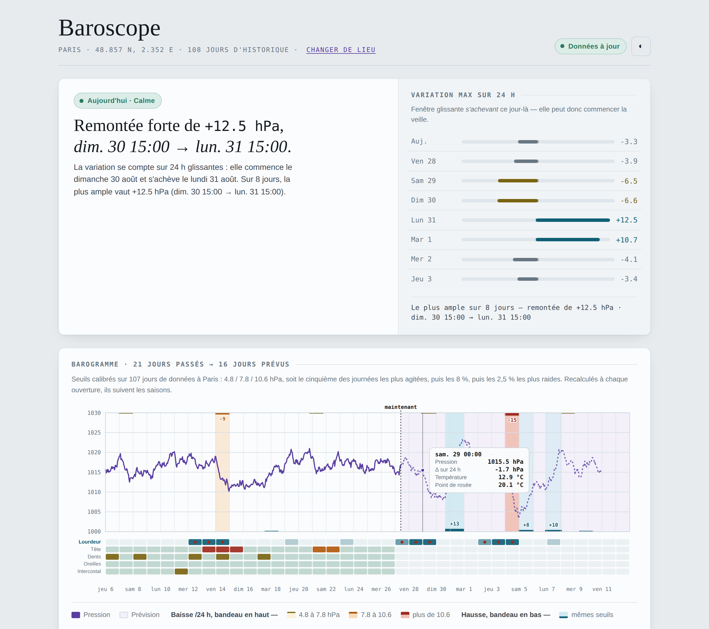

# Baroscope

Une page HTML autonome pour tester, sur soi-même, si ses douleurs suivent la météo — pression atmosphérique, temps lourd, orage, température. Un fichier, aucune dépendance, aucun serveur, aucune donnée qui sort du navigateur.

> *A single-file web app to test, on yourself, whether your headaches track the weather. French UI, no build step, no server, no data leaves your browser.*



<sup>Capture avec un journal de démonstration. Les données de pression sont réelles ; les symptômes sont simulés.</sup>

## À quoi ça sert

Beaucoup de gens sont convaincus que leurs migraines suivent le temps. La littérature dit que c'est vrai pour une minorité, et que la plupart de ceux qui le croient se trompent quand on vérifie sur agenda. Le seul moyen de savoir de quel côté on est, c'est de mesurer — chez soi, sur plusieurs mois.

Baroscope fait deux choses :

- **Anticiper.** Il affiche la pression des 21 jours passés et des 16 jours à venir, et signale les épisodes de variation marquée ainsi que les journées lourdes ou orageuses.
- **Vérifier.** Il tient un journal quotidien de symptômes et confronte les deux séries, avec les précautions statistiques qu'exige ce genre d'exercice.

## Utilisation

Télécharge `index.html` et ouvre-le dans un navigateur. C'est tout.

Si le navigateur bloque la requête réseau depuis `file://` (message « Hors ligne » au démarrage), sers le fichier localement :

```sh
python3 -m http.server 8000
# puis http://localhost:8000/index.html
```

Le lieu se change dans l'en-tête — recherche par ville, commune ou code postal.

## Ce qui est mesuré

Chaque jour, à partir des données horaires :

| Facteur | Mesure | Pourquoi |
|---|---|---|
| Baisse de pression | Chute maximale sur 24 h glissantes | Le facteur le mieux documenté pour les céphalées |
| Hausse de pression | Hausse maximale sur 24 h glissantes | Mécanisme distinct côté oreille moyenne, à ne pas présumer absent |
| Lourdeur | Point de rosée max | Mesure physique de la lourdeur de l'air ; l'humidité relative ne dit rien sans la température |
| Orage | CAPE max | Énergie convective, indice standard du potentiel orageux |
| Température | Moyenne du jour | Effet plus net que la pression dans la plus large étude disponible |
| Variation thermique | Écart max sur 24 h | Piste exploratoire |

Les fenêtres sont repérées par horodatage, pas par index : les journées de changement d'heure (23 ou 25 h locales) et les trous dans la série ne faussent pas les calculs.

## Méthode

- **Journal complet obligatoire.** Sans jours sans douleur, aucune corrélation n'est calculable. Un bouton « journée sans douleur » enregistre un jour à zéro en un clic.
- **Décalages testés** à J, J−1 et J−2 : le délai entre l'exposition et la douleur n'est pas établi dans la littérature, il ne faut donc pas en présumer un.
- **Test de permutation** (2 000 rééchantillonnages), sans hypothèse de normalité, robuste sur petits effectifs.
- **Correction de Benjamini-Hochberg.** 72 tests sont effectués ; lire les `p` bruts reviendrait à retenir du hasard. La colonne `q` donne le taux de fausses découvertes, appliqué séparément aux hypothèses pré-spécifiées et aux pistes exploratoires.
- **Contrôle des facteurs de confusion.** Le test est refait sur les seules journées sans alcool notable, sans mauvaise nuit, sans jeûne prolongé et sans déficit de caféine. Un effet qui n'y survit pas n'était pas celui de la météo.
- **Seuils auto-calibrés** sur la distribution locale : 4 hPa/24 h est ordinaire à Brest et remarquable à Nice. Ils ne servent qu'à l'affichage — les tests portent sur les valeurs continues.
- **Observer, pas interpréter.** Les colonnes de contexte enregistrent des faits vérifiables (nombre de verres, nombre de tasses), jamais un jugement du type « moins que d'habitude ». L'écart à l'habitude est dérivé après coup, à partir de la médiane glissante sur 30 jours.

## Données

Météo : [Open-Meteo](https://open-meteo.com/) (CC-BY 4.0), sans clé d'API. Réanalyse pour le passé, prévision jusqu'à 16 jours.

Journal : `localStorage`, dans ton navigateur, sur ta machine. Rien n'est envoyé nulle part — il n'y a pas de serveur. Corollaire : vider les données de navigation efface le journal. Un bouton de sauvegarde `.json` est prévu pour ça, et un export `.csv` permet de reprendre l'analyse ailleurs.

L'historique de pression est stocké **par lieu**, et chaque journée du journal retient l'endroit où elle a été saisie : un séjour ailleurs ne mélange pas deux climats dans la même série.

## Limites

Ce n'est pas un dispositif médical et ça ne remplace aucun avis médical. C'est un instrument d'observation personnelle, avec les faiblesses du genre : effectifs modestes, symptômes auto-déclarés, facteurs de confusion nombreux. Une corrélation n'est pas une causalité, et l'absence de corrélation est un résultat en soi — probablement le plus fréquent.

## Licence

MIT.
